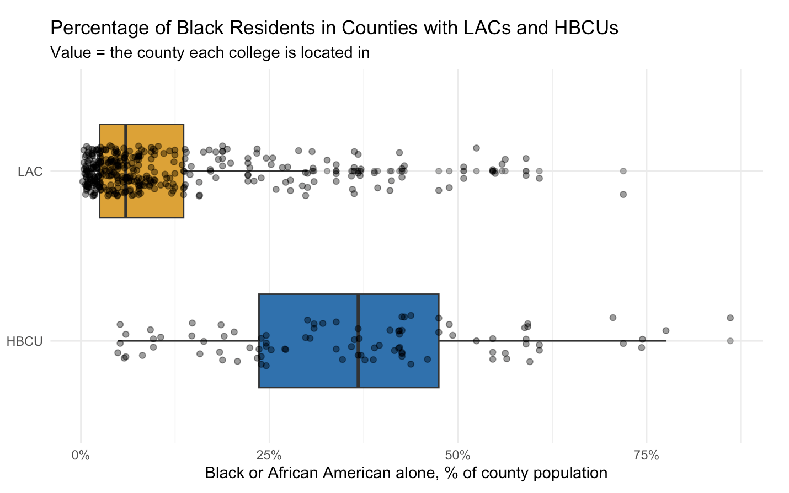
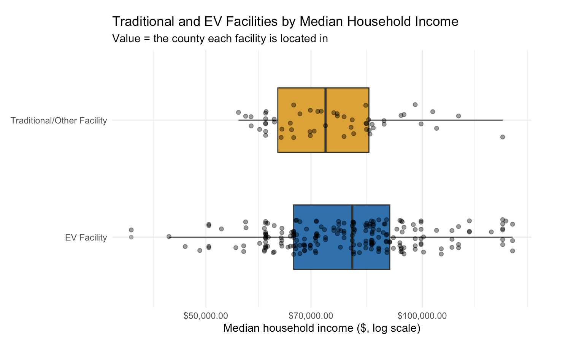
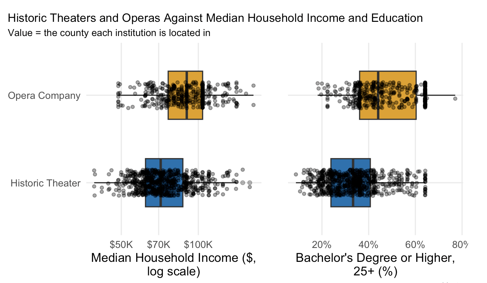

# Mapping American Institutions Against U.S. Census Data

During the course of this project, I focused on four types of American cultural and economic institutions—colleges, automotive and EV facilities, historic theaters, and opera companies—against county-level U.S. Census data (2020–2024 ACS 5-year estimates via IPUMS NHGIS). Each institution is plotted at its physical location and layered over counties shaded by a Census variable (e.g. racial demographics, median household income, or educational attainment). Along with locating where these institutions are on a map, I was curious about how their broader geography depicts which populations are served, and how it can convey a greater historical context behind each institution.

## Colleges

Amidst analyzing the mapped data across colleges, there was a noticeable difference between liberal arts colleges (LACs) and historically Black colleges and universities (HBCUs)—their geographic locations. Specifically, HBCUs are located predominantly in the South, whereas LACs are broadly scattered across the Northeast, Midwest, South, and West Coast.

In further analysis using US Census county data, counties with HBCUs have a significantly higher average percentage of Black or African American residents (\~37%) compared to the average percentage in counties with LACs (\~5%). While this pattern is comprehensible, as HBCUs would be most populous in areas with higher percentages of Black populations, this trend also carries significant historical context.

Prior to the American Civil War (1861–65), the first HBCUs were founded in Pennsylvania, DC, and Ohio. Although slavery was illegal in the North, racial discrimination against the education of Black Americans was prevalent, so only a few HBCUs were established there. After the end of the Civil War and the abolition of slavery, the federal Freedmen's Bureau operated throughout Reconstruction to aid formerly enslaved people. In the South, where segregation and inequality were most prevalent toward Black people, institutions that would become HBCUs facilitated access to education. Many remain today as both vital institutions that provide higher education for Black students and archives of American history.

Ultimately, populations across counties with HBCUs have more Black residents on average than counties with LACs. For future research, one potential question to examine is why there are few HBCUs located in the Northeast and Midwest, depite those regions having large Black populations both before and during the Great Migration?

## Automotive & EV Facilities

When shading counties by average median household income, those with EV facilities skew slightly higher than counties with traditional/other automotive facilities. Geographically, traditional facilities cluster in the Midwest and South, following patterns of America's past in auto-manufacturing. In contrast, EV facilities are scattered more broadly across the country, appearing along the West Coast and in the Northeast in addition to the Midwest and South.

This regional difference distinguishes two economic paths and their intersection. On one end, traditional facilities largely follow the geography of the 20th-century auto industry: Detroit and the surrounding Rust Belt, plus the South's more recent wave of manufacturing plants drawn by lower labor costs and tax incentives. On the other end, EV facilities follow a newer, more dispersed map, shaped less by where cars have historically been built and more by where they are being bought and serviced. This includes coastal metro areas with higher incomes, stronger EV adoption rates, and state-level incentive programs.

The distinction between facilities matters because it suggests the EV transition is not simply following the automotive mapping patterns of the past, but is also establishing a different one that is weighted toward higher-income, higher-density regions rather than the traditional manufacturing belt.

A future direction might be asking whether the income gap between EV and traditional facility counties is driven more by consumer affordability, or by where infrastructure investment and state incentives are concentrated. In either circumstance, this map will continue changing as EV adoption continues to be pushed throughout states.

## Theaters and Operas

Average median household income for counties with historic theaters—both NRHP-listed and LHAT member theaters—ranges around \$70,000. In comparison, counties with opera companies and their associate organizations run noticeably higher, averaging above \$70,000 across the members and ranging from nearly \$77,500 up to just over \$100,000.

Additionally, another gap is distinguishable when examining education. In particular, the average percentage of county residents 25 and older with a bachelor's degree or higher is around 32–34% for counties with historic theaters, compared to approximately 41–65% for counties with opera companies.

Between these differences is an outlook into each art form's institutional history. Particularly on the National Register of Historic Places, historic theaters represent a broad cross-section of American towns and cities; many began as neighborhood movie palaces or vaudeville houses meant for general audiences who were working-/middle-class. The preservation and record of these locations today reflect the significant local history tied back to these communities. Opera, on the other hand, has often been associated with urban elite patronage: opera houses were historically built and sustained by wealthy benefactors, and this legacy of high-income, highly educated donor and audience bases continues to appear where opera companies are located and supported today.

Altogether, future analysis may address whether these differences reflect disparities of access in "high culture" arts institutions like opera, compared to the more geographically and socioeconomically democratic footprint of historic theaters. Also, examining whether opera companies at the lower end of the income range—near \$77,500—differ meaningfully in size, funding model, or community outreach from those in the highest-income counties could be another future direction.

### Sources:

**Colleges**

-   [britannica.com – Historically Black Colleges and Universities](https://www.britannica.com/topic/historically-black-colleges-and-universities)
-   [hbcufirst.com – HBCU History Timeline](https://hbcufirst.com/resources/hbcu-history-timeline)
-   [journals.openedition.org](https://journals.openedition.org/qds/4044)
-   [archives.gov – The Great Migration](https://www.archives.gov/research/african-americans/migrations/great-migration)

**Automotive Facilities**

-   [motorcities.org – Southwest Detroit Auto Heritage Guide](https://www.motorcities.org/southwest-detroit-auto-heritage-guide/early-auto-boom)
-   [recurrentauto.com – States Leading the EV Revolution](https://www.recurrentauto.com/research/states-leading-the-ev-revolution)

**Theaters and Operas**

-   [americantheatre.org – Going National: How America's Regional Theatre Movement Changed the Game](https://www.americantheatre.org/2015/06/16/going-national-how-americas-regional-theatre-movement-changed-the-game/)
-   [researchguides.library.vanderbilt.edu](https://researchguides.library.vanderbilt.edu/c.php?g=69054&p=449679)
